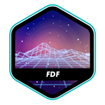
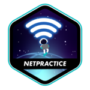
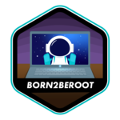

<h1 align="center">🇹🇭 42 Bangkok – Projects Overview</h1>

Welcome! This page showcases the main projects I completed during my scholarship at 42 Bangkok. 
Projects are ordered from most recent and complex to foundational work. 
Each logo links to its corresponding GitHub repository.

<!-- 1 - ft_transcendence -->
<table width="100%" cellspacing="0" cellpadding="0" border="0">
  <tr>
    <td width="120">
      
    </td>
    <td>
      <strong>ft_transcendence</strong> — A full-stack web app (JavaScript, NextJS, PostgreSQL, WebSockets, Django, Grafana, Vault).
      The app features multiplayer Pong, real-time chat, authentication, and admin tools via a Dockerized infrastructure.
    </td>
  </tr>
</table>

<!-- 2 - Webserv -->
<table width="100%" cellspacing="0" cellpadding="0" border="0">
  <tr>
    <td align="right">
      <strong>Webserv</strong> — A lightweight HTTP/1.1 server built in C++.
      This project introduced me to socket programming, CGI handling, and HTTP protocol implementation.
    </td>
    <td width="120" align="right">
      
    </td>
  </tr>
</table>

<!-- 3 - Inception -->
<table width="100%" cellspacing="0" cellpadding="0" border="0">
  <tr>
    <td width="120">
      
    </td>
    <td>
      <strong>Inception</strong> — A Docker-based project to containerize WordPress, Nginx, and MariaDB.
      It taught me volume mapping, Docker networking, and multi-container orchestration.
    </td>
  </tr>
</table>

<!-- 4 - cub3D -->
<table width="100%" cellspacing="0" cellpadding="0" border="0">
  <tr>
    <td align="right">
      <strong>cub3D</strong> — A basic raycasting engine rendering 3D-like graphics in a 2D map.
      This project strengthened my grasp of math, geometry, and real-time rendering.
    </td>
    <td width="120" align="right">
      
    </td>
  </tr>
</table>

<!-- 5 - CPP Modules -->
<table width="100%" cellspacing="0" cellpadding="0" border="0">
  <tr>
    <td width="120">
      
    </td>
    <td>
      <strong>CPP Modules</strong> — A series of OOP-focused exercises in C++ covering inheritance and polymorphism.
      I learned constructors, references, exceptions, and design patterns like interfaces.
    </td>
  </tr>
</table>

<!-- 6 - Minishell -->
<table width="100%" cellspacing="0" cellpadding="0" border="0">
  <tr>
    <td align="right">
      <strong>Minishell</strong> — A simplified shell implementation supporting pipes, redirections, and environment variables.
      It deepened my grasp of parsing logic, signal handling, and built-in commands.
    </td>
    <td width="120" align="right">
      
    </td>
  </tr>
</table>

<!-- 7 - Philosophers -->
<table width="100%" cellspacing="0" cellpadding="0" border="0">
  <tr>
    <td width="120">
      
    </td>
    <td>
      <strong>Philosophers</strong> — An implementation of the dining philosophers concurrency problem.
      It helped me learn mutexes, deadlocks, and thread synchronization in C.
    </td>
  </tr>
</table>

<!-- 8 - push_swap -->
<table width="100%" cellspacing="0" cellpadding="0" border="0">
  <tr>
    <td align="right">
      <strong>push_swap</strong> — An algorithmic project to sort a stack using limited instructions.
      It challenged my ability to optimize code for time and move count efficiency.
    </td>
    <td width="120" align="right">
      
    </td>
  </tr>
</table>

<!-- 9 - FDF -->
<table width="100%" cellspacing="0" cellpadding="0" border="0">
  <tr>
    <td width="120">
      
    </td>
    <td>
      <strong>FDF</strong> — A 3D wireframe renderer built with miniLibX and matrix projections.
      It strengthened my understanding of file parsing, graphics programming, and trigonometry.
    </td>
  </tr>
</table>

<!-- 10 - Pipex -->
<table width="100%" cellspacing="0" cellpadding="0" border="0">
  <tr>
    <td align="right">
      <strong>Pipex</strong> — A small clone of shell piping using `execve`, forks, and redirections.
      This project solidified my knowledge of processes, environment variables, and system calls.
    </td>
    <td width="120" align="right">
      
    </td>
  </tr>
</table>

<!-- 11 - Net Practice -->
<table width="100%" cellspacing="0" cellpadding="0" border="0">
  <tr>
    <td width="120">
      
    </td>
    <td>
      <strong>Net Practice</strong> — A set of network simulations for practicing routing and subnetting.
      This project introduced me to CIDR, IP classes, and basic network troubleshooting.
    </td>
  </tr>
</table>

<!-- 12 - Born2beroot -->
<table width="100%" cellspacing="0" cellpadding="0" border="0">
  <tr>
    <td align="right">
      <strong>Born2beroot</strong> — A system administration project to set up a secure Linux server.
      It introduced me to user roles, SSH, UFW, and basic hardening on Debian.
    </td>
    <td width="120" align="right">
      
    </td>
  </tr>
</table>

<!-- 13 - get_next_line -->
<table width="100%" cellspacing="0" cellpadding="0" border="0">
  <tr>
    <td width="120">
      
    </td>
    <td>
      <strong>get_next_line</strong> — Reads text from a file descriptor line by line.
      A project focused on buffer management, memory safety, and file I/O handling in C.
    </td>
  </tr>
</table>

<!-- 14 - ft_printf -->
<table width="100%" cellspacing="0" cellpadding="0" border="0">
  <tr>
    <td align="right">
      <strong>ft_printf</strong> — A reproduction of the `printf` function in C with format parsing and custom specifiers.
      It sharpened my understanding of variadic functions, buffer handling, and string manipulation.
    </td>
    <td width="120" align="right">
      
    </td>
  </tr>
</table>

<!-- 15 - Libft -->
<table width="100%" cellspacing="0" cellpadding="0" border="0">
  <tr>
    <td width="120">
      
    </td>
    <td>
      <strong>Libft</strong> — A custom implementation of the C standard library.
      This project taught me to manage memory, pointers, and low-level logic in C from scratch.
    </td>
  </tr>
</table>

---

✨ These projects represent my journey from C fundamentals to full-stack development!

