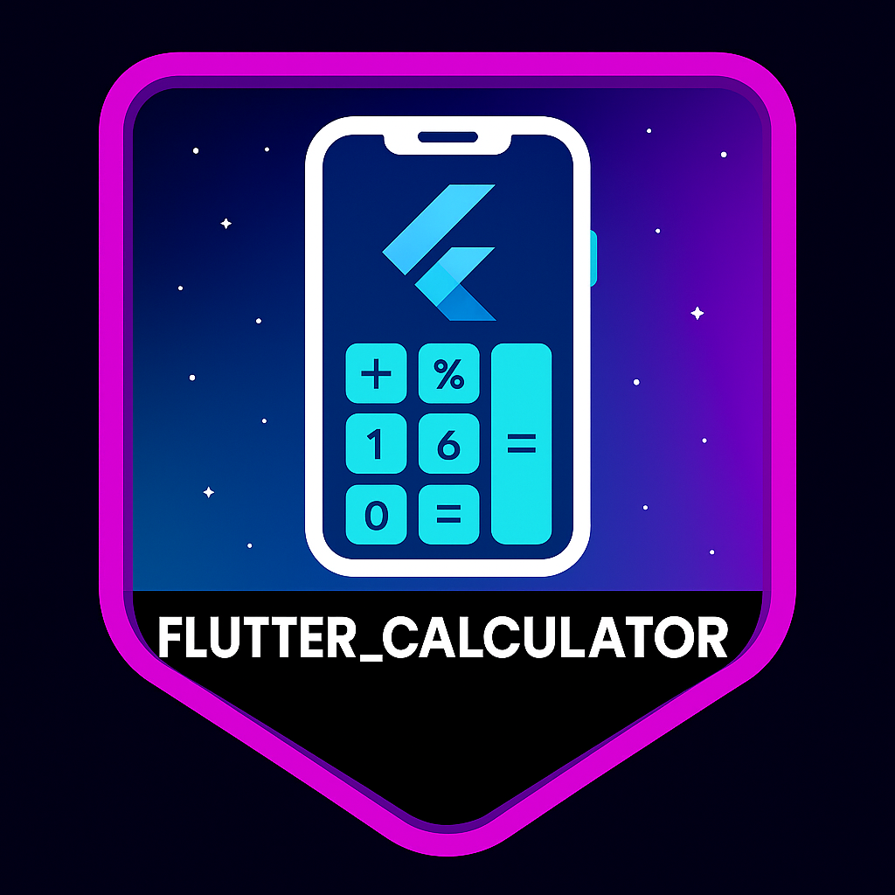

<h1 align="center"> Flutter – Projects Overview</h1>

Welcome! This page gathers all the Flutter projects I completed by my own to improve my skills. 
Each logo links to its corresponding GitHub repository.

<!-- 1 -->
<table width="100%" cellspacing="0" cellpadding="0" border="0">
  <tr>
	<td width="120">
	  
	</td>
	<td>
	  <strong>Flutter_calculator</strong> — This is a simple and fully functional calculator app built with Flutter.
	</td>
  </tr>
</table>

✨ Stay tuned for more projects and improvements!

