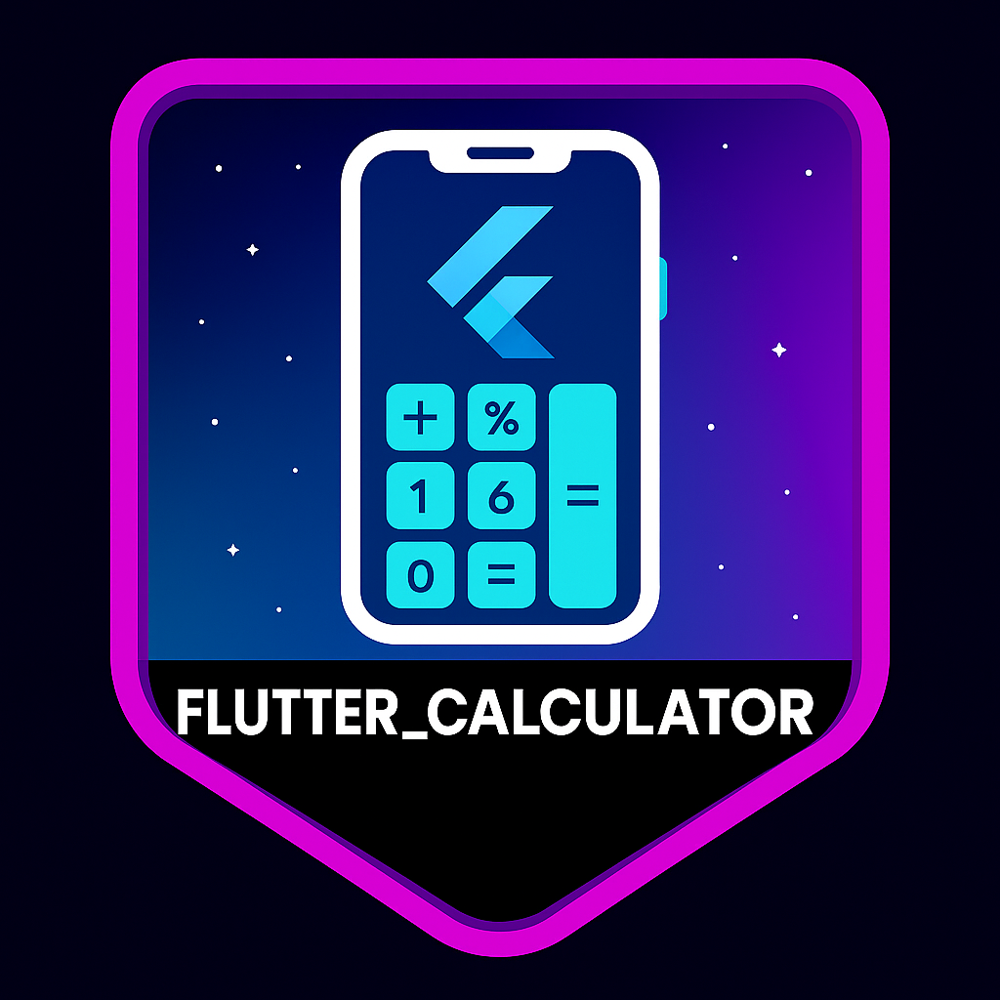

<h1 align="center"> Flutter – Projects Overview</h1>

Welcome! This page showcases Flutter projects from production apps to learning experiments. 
Each logo links to its corresponding repository or store page.

<h2>🚀 Production Apps</h2>

<!-- My Garage -->
<table width="100%" cellspacing="0" cellpadding="0" border="0">
  <tr>
	<td width="120">
	  
	</td>
	<td>
	  <strong>My Garage</strong> — A car maintenance tracker with service reminders, document storage, and full maintenance history. Built with Flutter, SQLite, and push notifications. 
	  ✅ <em>Available on Google Play Store – March 2026</em> 
	  🌐 <a href="https://studio-hotaru.com/applications/my-garage/" target="_blank">Website</a> · 
	  📱 <a href="https://play.google.com/store/apps/details?id=com.studiohotaru.mygarage" target="_blank">Download</a>
	</td>
  </tr>
</table>

<h2>📚 Learning Projects</h2>

<!-- Calculator -->
<table width="100%" cellspacing="0" cellpadding="0" border="0">
  <tr>
	<td width="120">
	  
	</td>
	<td>
	  <strong>Flutter Calculator</strong> — A simple and fully functional calculator app built to learn Flutter basics and state management.
	</td>
  </tr>
</table>

✨ Stay tuned for more projects and improvements!

