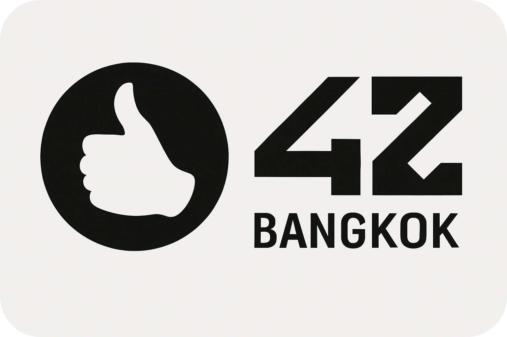

<h1 align="center">Hi! I'm Jeremy</h1>

  <strong>Mobile & Backend Developer | 42 Bangkok Graduate</strong>

  🚗 Building <strong>My Garage</strong> – A car maintenance app launching February 2026 
  💻 Specialized in Flutter, C++, Docker, and system-level programming 
  🎓 Scholarship graduate from 42 Bangkok coding school

  Welcome to my GitHub profile! 
  Here you'll find my featured projects.

 

<table width="100%">
  <tr>
    <td width="260">
      
    </td>
    <td>
      <strong>Mobile apps built with Flutter</strong> 
      From production-ready apps to learning projects, showcasing UI design, state management, and local storage. 
      These projects reflect my journey into cross-platform mobile development.
    </td>
  </tr>
</table>

 

<table width="100%">
  <tr>
    <td align="right">
      <strong>Projects completed during my scholarship at 42 Bangkok</strong> 
      These projects cover C/C++ programming, algorithms, and system-level development. 
      They were essential to mastering the fundamentals of low-level programming.
    </td>
    <td width="260" align="right">
      
    </td>
  </tr>
</table>
